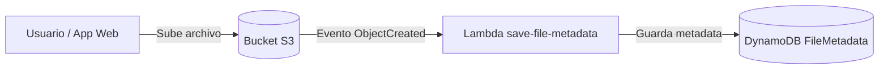
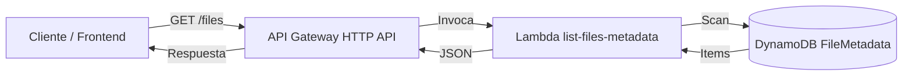

# S3 Upload Demo (Node.js)

Aplicación mínima con interfaz web para cargar archivos a Amazon S3.
Incluye listado de archivos registrados en DynamoDB (a través de una Lambda/API).

## Requisitos

- Node.js 18+
- Cuenta AWS con permisos `s3:PutObject` sobre el bucket destino

## Configuración

1. Instala dependencias:

```bash
npm install
```

2. Crea el archivo `.env` desde el ejemplo:

```bash
cp .env.example .env
```

3. Edita `.env` con tus valores reales.

Si usas AWS Academy (credenciales temporales), también define:

- `AWS_SESSION_TOKEN`

Opcional:

- `FILES_API_URL` endpoint `GET` de API Gateway/Lambda para listar archivos (por defecto usa `https://t9u1v220t1.execute-api.us-east-1.amazonaws.com/prod/files`).

## Ejecutar

```bash
npm run dev
```

O en modo normal:

```bash
npm start
```

Abre `http://localhost:3000` y sube un archivo.

## Endpoints

- `GET /health` estado del servicio
- `POST /upload` carga de archivo (campo `file`)
- `GET /files` proxy al endpoint de listado para poblar el frontend

## Arquitectura

### Flujo S3 con Lambda



### Flujo API AWS con Lambda



## Lambda de listado (referencia)

Se agregó un ejemplo en:

- `lambda/list_files_lambda.py`

Esta Lambda hace `scan` a la tabla DynamoDB (`DYNAMODB_TABLE_NAME`, default `FileMetadata`) y retorna JSON con CORS habilitado.
